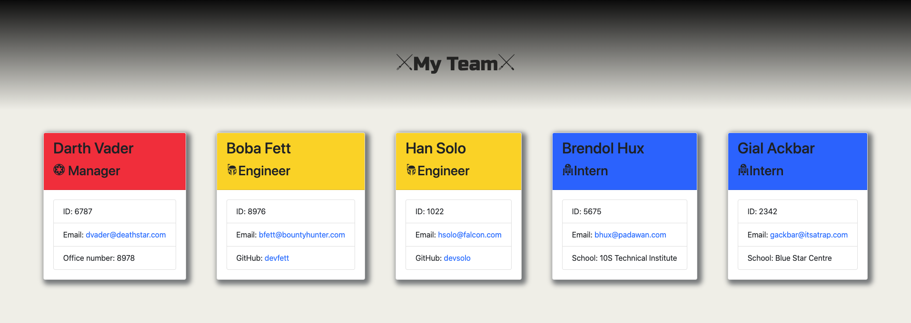
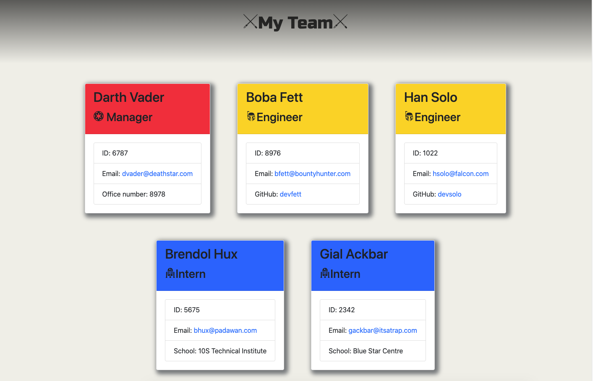

# Homework 10: Template Engine


    
## Table of Contents
* [Description](#description)
* [Installation](#installation)
* [Usage](#usage)
* [Tests](#test)
* [Questions](#questions)
* [Contributing Authors](#contributors)
* [License](#license)
    
# Description
Homework 10: Template Engine is a software engineering team generator command line application. It is a Node CLI that takes in information about employees and generates an HTML webpage that displays summaries for each person. This application uses a combination of JavaScript, Node.js, jQuery, HTML, css, and json.



    
## Installation
Clone repository to your local drive. Run ```npm install``` to install dependencies.
    
## Usage
The application prompts the user for information about the team manager and then information about the team members. The user can input any number of team members, and they may be a mix of engineers and interns. When the user has completed building the team, the application creates an HTML file that displays a nicely formatted team roster based on the information provided by the user.

* <a href="https://vimeo.com/463565411">Link to Demo Video</a>


            
## Tests
Testing can be performed by running ```npm test```. All tests currently passing.

            
## Questions
All questions regarding this application can be directed to: 
 
<a href="https://github.com/cascutter">cascutter</a> 

<a href="mailto:cascutter13@gmail.com">cascutter13@gmail.com</a>
    
# Contributing Authors
* Casandra Cutter 
* <a href="http://starwarsglyphicons.com/">Star Wars Glyph Icons</a>
    
# License
MIT License
